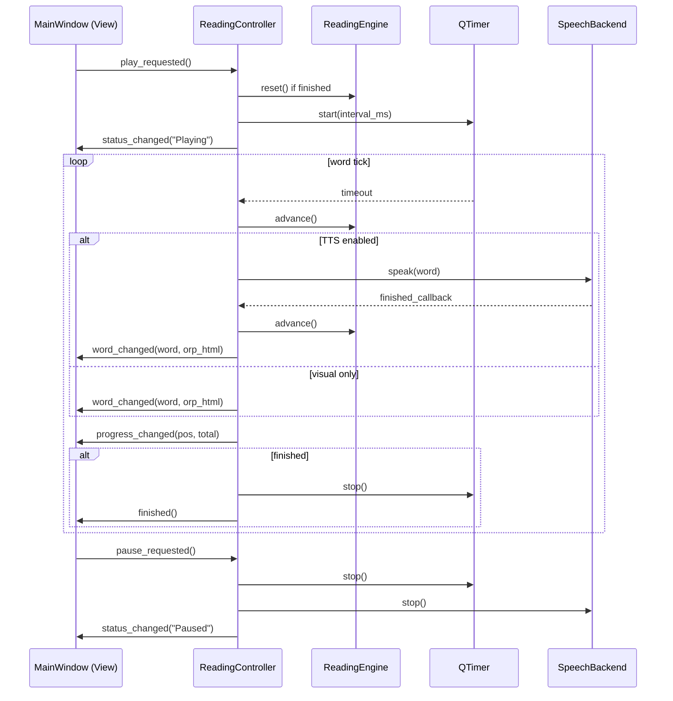
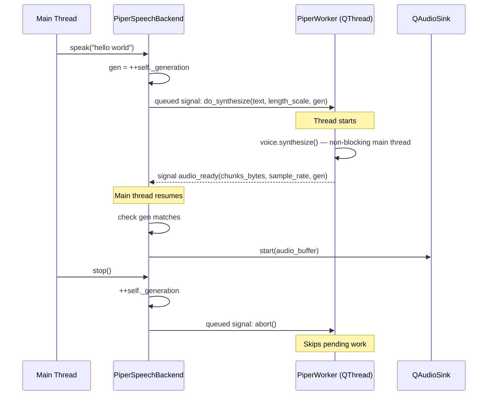

# Design: Separate Core, CLI, TTS, and GUI

## Technical Approach

Extract pure-Python modules into `src/speedreader/core/` with zero Qt imports, keeping backward-compatible re-export shims at old paths. Add a `ReadingController` to extract playback state/timers from the 765-line `MainWindow` god class. Add `speedreader-cli` via typer. Move Piper ONNX synthesis to a `QThread` worker.

All 5 phases are independent commits, each with verified tests before/after.

## Architecture Decisions

| # | Decision | Choice | Alternatives | Rationale |
|---|----------|--------|--------------|-----------|
| D1 | Core package location | `src/speedreader/core/` | Top-level `speedreader_core/` | Stays under existing namespace; import paths stay familiar |
| D2 | SettingsProtocol location | `core/protocols.py` | Per-spec modules | Single file for SettingsProtocol + ClipboardProtocol; both are pure typing |
| D3 | ClipProtocol reuse | Promote private `_ClipboardLike` → public `ClipboardProtocol` in `core/protocols.py` | Copy definition | Single canonical protocol; both GUI and CLI import the same type |
| D4 | CLI framework | `typer` (no PySide6) | `argparse` | Spec requires typer; faster to build, stdout RSVP via `\r` + `shutil.get_terminal_size` |
| D5 | CLI settings backend | JSON file at `~/.config/speedreader/cli-settings.json` | Environment variables | Persists WPM across sessions w/o QSettings; simple dict read/write |
| D6 | Piper threading | `QThread` + generation counter | `subprocess` pipe | Matches Qt event loop; generation counter avoids stale audio race |
| D7 | Controller comms | `QtCore.Signal` | Callback dict | Native Qt signal-slot; view connects directly, no adapter layer |

## Package Structure

```
src/speedreader/
├── __init__.py              # Re-exports from core/
├── app.py                   # Unchanged (Qt-only)
├── core/                    # ★ NEW — Zero Qt imports
│   ├── __init__.py
│   ├── domain.py            # TextSegment, SegmentKind (moved)
│   ├── engine.py            # ReadingEngine, WordToken (moved)
│   ├── orp.py               # optimal_recognition_index, format_word_with_orp (moved)
│   ├── profiles.py          # ReadingProfile, READING_PROFILES, multipliers (moved)
│   ├── speech.py            # SpeechBackend Protocol (moved from speech/base.py)
│   ├── protocols.py         # ★ SettingsProtocol, ClipboardProtocol
│   └── importers/
│       ├── __init__.py      # Re-exports from core/
│       ├── file.py          # FileImporter (moved)
│       ├── markdown.py      # MarkdownImporter (moved)
│       ├── plain_text.py    # PlainTextImporter (moved)
│       └── clipboard.py     # ClipboardImporter (moved, uses ClipboardProtocol)
├── cli/                     # ★ NEW — Headless, no PySide6
│   ├── __init__.py
│   ├── main.py              # typer app: speedreader-cli -> main()
│   ├── reader.py            # RSVP display loop (ORP highlighting via ANSI)
│   └── settings.py          # JsonSettingsStore(SettingsProtocol)
├── domain.py                # SHIM: from core.domain import *  # noqa
├── engine.py                # SHIM: from core.engine import *  # noqa
├── orp.py                   # SHIM
├── profiles.py              # SHIM
├── settings.py              # SettingsStore (still QSettings-based, implements SettingsProtocol)
├── importers/
│   ├── __init__.py          # SHIM
│   ├── clipboard.py         # SHIM
│   ├── file.py              # SHIM
│   ├── markdown.py          # SHIM
│   └── plain_text.py        # SHIM
├── speech/
│   ├── base.py              # SHIM — re-exports SpeechBackend from core.speech
│   ├── factory.py           # Unchanged
│   ├── piper_backend.py     # ★ Modified — threaded synthesis
│   ├── qt_backend.py        # Unchanged
│   ├── rate.py              # Unchanged
│   └── voices.py            # Unchanged
└── ui/
    ├── __init__.py
    ├── main_window.py       # ★ Modified — thin view only
    ├── reading_controller.py # ★ New — owns engine, timers, speech
    └── shortcuts_dialog.py  # Unchanged
```

## Mermaid Diagrams

### Component Dependency

```mermaid
flowchart TD
    subgraph GUI [speedreader]
        MW[MainWindow\n(thin view)] --> RC[ReadingController\nsignals+timers]
        RC --> RE[core.engine.ReadingEngine]
        RC --> SB[SpeechBackend\nprotocol]
        SB --> PB[PiperSpeechBackend\nQThread worker]
        SB --> QB[QtSpeechBackend\nunchanged]
    end

    subgraph CLI [speedreader-cli]
        CR[cli.reader\nRSVP loop] --> RE
        CR --> JS[cli.settings.JsonSettingsStore]
        CR --> CP[ClipboardProtocol]
    end

    subgraph CORE [core/ — zero Qt]
        RE
        CO[core.orp, core.profiles]
        CD[core.domain\nTextSegment]
        CPROTO[core.protocols\nSettingsProtocol, ClipboardProtocol]
    end

    GUI -.->|re-export shims| CORE
    CLI -.->|direct imports| CORE
```

### ReadingController Signal Flow



### Piper Threading



## Interfaces / Contracts

### SettingsProtocol (`core/protocols.py`)

```python
class SettingsProtocol(Protocol):
    def load_wpm(self, default: int = 400) -> int: ...
    def save_wpm(self, wpm: int) -> None: ...
    def load_tts_wpm(self, default: int | None = None) -> int: ...
    def save_tts_wpm(self, wpm: int) -> None: ...
    def load_font_size(self, default: int = 42) -> int: ...
    def save_font_size(self, size: int) -> None: ...
    def load_tts_enabled(self, default: bool = False) -> bool: ...
    def save_tts_enabled(self, enabled: bool) -> None: ...
    def load_reading_profile(self, default: str = "normal") -> str: ...
    def save_reading_profile(self, profile_id: str) -> None: ...
    def load_reading_session(self) -> ReadingSession | None: ...
    def save_reading_session(self, source_path: str, position: int) -> None: ...
    def clear_reading_session(self) -> None: ...
```

### ClipboardProtocol (`core/protocols.py`)

```python
class ClipboardProtocol(Protocol):
    def text(self) -> str: ...
```

### SpeechBackend (`core/speech.py` — unchanged from existing)

```python
class SpeechBackend(Protocol):
    @property
    def name(self) -> str: ...
    def set_rate_from_wpm(self, wpm: int, pace_multiplier: float = 1.0) -> None: ...
    def set_finished_callback(self, callback: Callable[[], None] | None) -> None: ...
    def speak(self, text: str) -> None: ...
    def stop(self) -> None: ...
```

### ReadingController Signals

```python
class ReadingController(QObject):
    word_changed = Signal(str)                # current word text
    status_changed = Signal(str)              # status bar text
    finished = Signal()                       # reading complete
    progress_changed = Signal(int, int)       # position, total
```

Controller public API: `load(segments, source, kind, resume_position)`, `play()`, `pause()`, `toggle()`, `stop()`, `seek(index)`, `previous_word()`, `next_word()`, `set_wpm(value)`, `set_profile(id)`, properties: `position`, `word_count`, `is_finished`, `is_empty`.

## Threading Design (Piper)

**Pattern**: `PiperWorker(QObject)` moved to a `QThread`. Communication via queued signal/slot (automatically cross-thread in Qt).

- **Worker** signal: `audio_ready(audio_bytes: QByteArray, sample_rate: int, generation: int)`
- **Worker** slot: `do_synthesize(text: str, length_scale: float, generation: int)`
- **Worker** slot: `abort()` — sets an `_aborted` flag checked between synthesis chunks

`PiperSpeechBackend` owns the `QThread` and worker, creates them once in `__init__`. `speak()` emits a queued signal to the worker. The generation counter ensures `audio_ready` from a cancelled call is ignored. `stop()` increments generation and calls `abort()`.

**Thread-safety**: Generation counter is read/written only on the main thread. Worker reads it at the start of synthesis. Abort flag is `bool` set from the main thread, checked on worker thread — no mutex needed for simple bool in CPython (GIL protects).

## Migration Plan (5 Work-Unit Commits)

| Commit | Scope | New Files | Modified Files | Deleted | Test Impact |
|--------|-------|-----------|----------------|---------|-------------|
| 1 — `core-reading` | domain, engine, orp, profiles → `core/` | `core/domain.py`, `core/engine.py`, `core/orp.py`, `core/profiles.py` | `domain.py`, `engine.py`, `orp.py`, `profiles.py` (become shims) | None | Move `tests/test_engine.py` → `tests/core/`; add `tests/core/test_core_no_qt.py` |
| 2 — `core-import` | Importers + protocols → `core/` | `core/importers/*`, `core/speech.py`, `core/protocols.py` | `importers/*.py`, `speech/base.py`, `settings.py` (shims) | None | Move importer tests → `tests/core/importers/`; add clipboard protocol tests |
| 3 — `cli-reader` | Typer CLI entry | `cli/main.py`, `cli/reader.py`, `cli/settings.py` | `pyproject.toml` (add script) | None | `tests/cli/` — argument parsing, display, Qt isolation |
| 4 — `gui-controller` | ReadingController | `ui/reading_controller.py` | `ui/main_window.py` (thin) | None | `tests/gui/test_reading_controller.py` |
| 5 — `tts-threading` | Piper worker thread | None (PiperWorker inside `piper_backend.py`) | `speech/piper_backend.py` | None | `tests/gui/test_tts_threading.py` |

## Backward-Compatibility Strategy

Each old module becomes a **single-line shim**:

```python
# src/speedreader/engine.py — shim
from speedreader.core.engine import *  # noqa: F401, F403
```

This ensures `from speedreader.engine import ReadingEngine` keeps working. Existing `tests/` imports are unaffected. `speedreader/__init__.py` continues re-exporting from old paths (which now just forward to core/).

## Testing Strategy

| Layer | What | Approach |
|-------|------|----------|
| Qt isolation | All core/ modules | `assert "PySide6" not in sys.modules` after import |
| Unit — core | ReadingEngine, ORP, profiles | Move existing tests unchanged to `tests/core/` |
| Unit — importers | File/Markdown/PlainText | Move existing tests; add FakeClipboard for clipboard |
| Unit — CLI | Args, display, settings | Mock stdin/stdout, test `JsonSettingsStore` with temp file |
| Unit — controller | Play/pause/seek signals | Isolated `ReadingController` with mocked callbacks |
| Integration | View ↔ controller | `QApplication` fixture, verify `MainWindow` reacts to signals |
| Integration | Piper threading | Mock `PiperVoice.synthesize` to emit `audio_ready`; verify main thread not blocked |
| Regression | All existing tests | `uv run pytest` must pass after every commit |

## Risks and Mitigations

| Risk | Likelihood | Impact | Mitigation |
|------|------------|--------|------------|
| Circular import via shim → core → old location | Low | Build break | Shims import `core.*`; `core/` never imports shims — enforced by CI |
| QSettings import in CLI path | Med | CLI broken w/o Qt | `JsonSettingsStore` used; `SettingsStore` only imported by GUI entry point |
| Controller extraction misses a state variable | Med | Runtime bug | Existing `test_main_window.py` as regression guard; compare behavior before/after |
| Generation counter race in threaded Piper | Low | Stale audio plays | Generation checked on main thread after `audio_ready`; single writer (main) |
| ORP ANSI in CLI differs from Qt HTML | Low | Visual mismatch OK | CLI uses ANSI bold/color; GUI uses Qt RichText — consistent ORP index |

## Open Questions

- [x] Where does `voices.py` live? → Stays in `speech/` (Qt path resolution). CLI doesn't need it.
- [x] Is `rate.py` moved to core? → No, it's only used by speech backends. Stays in `speech/`.
- [ ] Does `SettingsStore` formally declare `SettingsProtocol` as a base class, or duck-type it?
